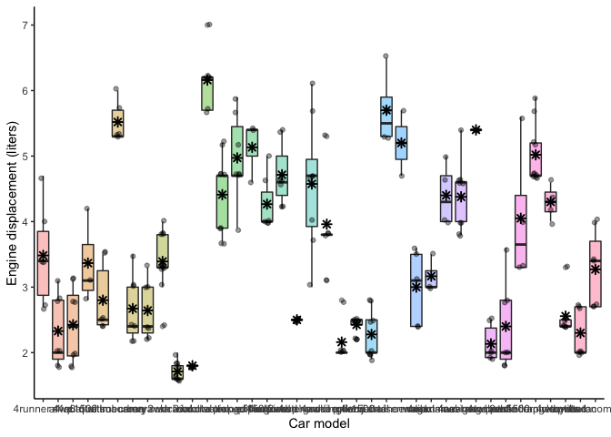

<!-- README.md is generated from README.Rmd. Please edit that file -->
# quickplot

<!-- badges: start -->
<!-- badges: end -->
The goal of quickplot is to create quick data exploration ggplot2 plots.

This package is a developing set of plot functions based on ggplot2. You choose a function, provide a tidy dataset, denote the variables, and it produces data exploration aesthetic plots ready for reports!

This package was developed for an assignment of the [STAT545B course](https://stat545.stat.ubc.ca) at the University of British Columbia.

## Installation

You can install the development version of quickplot like so:

``` r
devtools::install_github("ErickNavarroD/quickplot") 
```

## Example

This is a basic example which shows you how to solve a common problem. Using an already available dataset in the ggplot2 package (`mpg`), we can plot the distribution of the engine displacement (*displ* variable) in the diferent car models (*model* variable).

``` r
library(quickplot)
library(ggplot2)

box_jitter_plot(mpg, 
                var_x = model,
                var_y = displ,
                x_label = "Car model",
                y_label = "Engine displacement (liters)",
                alpha_boxplot = 0.4,
                alpha_jitter = 0.4,
                width_jitter = 0.15)
#> Warning: Removed 38 rows containing missing values (geom_segment).
```



The plot was succesfully made. However, for this specific case, there are too many categorical variables in the x axis, which makes it hard to read them. This can be easily solved by adding an extra ggplot layer. This is a very useful example because you can observe that the output of the function is a ggplot object, which can be further modified to the user's convenience.

``` r
box_jitter_plot(ggplot2::mpg, 
                var_x = model,
                var_y = displ,
                x_label = "Car model",
                y_label = "Engine displacement (liters)",
                alpha_boxplot = 0.4,
                alpha_jitter = 0.4,
                width_jitter = 0.15)+
  ggplot2::coord_flip()
#> Warning: Removed 38 rows containing missing values (geom_segment).
```


